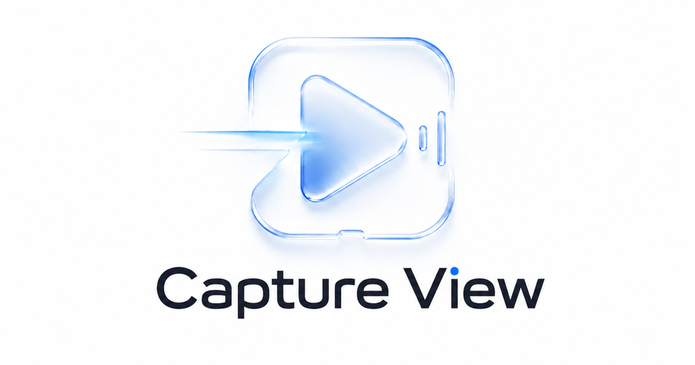

# capture-view



Native low-latency HDMI USB capture-card viewer for Linux.

Current features:

- V4L2 device discovery
- manual video format selection
- streaming V4L2 MMAP capture with 2-3 buffers
- newest-frame-only dropping
- MJPEG decode through libjpeg-turbo
- YUYV/NV12 conversion
- SDL3 streaming texture preview
- optional PipeWire audio monitor
- optional PipeWire virtual audio source
- optional v4l2loopback video output
- SDL GPU-backed YUYV/NV12 texture upload path
- optional linear GPU texture upscale for 1440p+ fullscreen viewing
- GTK launcher UI for wizard-style device/mode/audio selection
- Kirsch bitmap font for SDL diagnostics overlays
- benchmark mode with latency-focused render metrics

## Why use it

`capture-view` is built for live HDMI capture monitoring, not media playback or recording. It keeps only the newest frame, drops stale data intentionally, and exposes timing metrics that general-purpose players usually hide.

Use it when you want:

- predictable low-latency preview for consoles or HDMI capture cards
- direct V4L2 capture with explicit format/FPS selection
- PipeWire audio monitoring and optional virtual audio source
- optional v4l2loopback video output for Discord/OBS-style workflows
- benchmark output for render latency, decode, upload, present, frame interval, and jitter
- a small native Linux tool instead of OBS, browser capture, or a full media player

## Dependencies

Arch Linux:

```sh
sudo pacman -S base-devel cmake ninja pipewire sdl3 gtk4 libjpeg-turbo v4l-utils
```

## Build

```sh
cmake -S . -B build -G Ninja
cmake --build build
```

Package locally:

```sh
makepkg -si
```

## Usage

List video devices and formats:

```sh
./build/capture-view --list-devices
```

List PipeWire audio nodes:

```sh
./build/capture-view --list-audio
```

Troubleshoot environment:

```sh
./build/capture-view --doctor
```

Interactive setup:

```sh
./build/capture-view --wizard --log-file capture-view.log
```

GTK launcher:

```sh
./build/capture-view --gtk
```

The GTK UI mirrors the setup wizard for graphical users: choose the capture device, ranked video mode, latency profile, optional PipeWire audio input/output, pacing, scaling, and toggles, then start the SDL viewer.

Profiles/config:

```sh
./build/capture-view --wizard --profile console --save-config
./build/capture-view --profile console
./build/capture-view --list-profiles
./build/capture-view --init-profiles
```

Diagnostic bundle:

```sh
./build/capture-view --diagnostic-bundle capture-view-diagnostics.txt
```

Expose capture audio as a PipeWire source for Discord:

```sh
./build/capture-view --video /dev/video2 --format mjpeg --audio-monitor \
  --audio-virtual-source "Capture View" --log-file capture-view.log
```

Discord should then be able to select `Capture View` as an audio source/microphone while you cast the screen.

Expose capture video as a v4l2loopback virtual camera:

```sh
sudo modprobe v4l2loopback video_nr=10 card_label="Capture View" exclusive_caps=1
./build/capture-view --video /dev/video2 --video-output /dev/video10 --format auto
```

The virtual camera can write `yuyv`, `nv12`, or `rgba` frames:

```sh
./build/capture-view --video /dev/video2 --video-output /dev/video10 --video-output-format nv12
```

Match capture size/FPS and output format to what the receiving app expects.

Write diagnostics to a file while also logging to stderr:

```sh
./build/capture-view --video /dev/video0 --format auto --latency-mode ultra --log-file capture-view.log --verbose
```

Choose frame pacing explicitly:

```sh
./build/capture-view --video /dev/video0 --frame-pacing immediate
./build/capture-view --video /dev/video0 --frame-pacing yield
./build/capture-view --video /dev/video0 --frame-pacing sleep --vsync
./build/capture-view --video /dev/video0 --frame-pacing adaptive
```

Use smoother GPU scaling for fullscreen 1080p on 1440p or higher displays:

```sh
./build/capture-view --video /dev/video0 --fullscreen --output-scaling fit --upscale-quality linear
```

Run a latency-focused benchmark:

```sh
tools/bench-v4l2.sh
```

Useful overrides:

```sh
DEVICE=/dev/video2 SIZE=1920x1080 FPS=60 FORMAT=mjpeg DURATION=60 tools/bench-v4l2.sh
OUT_DIR=bench-results/manual-test FRAME_PACING=immediate tools/bench-v4l2.sh
```

The script writes `capture-view.log` and `summary.txt` under `bench-results/...`.

Test only audio output with a quiet 440 Hz tone:

```sh
./build/capture-view --test-pattern --audio-test-tone --audio-output "YOUR_SINK_NAME" --log-file audio-test.log
```

Open a capture card:

```sh
./build/capture-view --video /dev/video0 --size 1920x1080 --fps 60 --format auto --no-vsync
```

Enable direct PipeWire monitoring:

```sh
./build/capture-view --video /dev/video0 --audio-monitor --audio-input "alsa_input.usb..." --audio-output "alsa_output..." --audio-buffer-ms 20 --audio-delay-ms 0
```

Run without hardware:

```sh
./build/capture-view --test-pattern
```

Shortcuts:

- `F`: fullscreen
- `V`: toggle vsync
- `S`: stats overlay
- `G`: GUI overlay
- `R`: restart capture
- `A`: restart audio monitor
- `M`: mute audio monitor
- `+` / `-`: audio monitor volume
- `O`: cycle scaling: fit, fill, stretch, integer
- `Esc`: exit fullscreen or quit
- `Q`: quit

Config is saved to `~/.config/lowlat-capture-viewer/config.toml`. Use `--no-config` for temporary runs.

Most V4L2 capture cards can only be opened by one app at a time. Close OBS, Discord, browser tabs, or other viewers if the device is busy.

## Benchmarks

Benchmark mode is focused on latency inside `capture-view`: decode, texture upload, present, and combined render latency. FPS and jitter remain in the log as supporting health signals, but the primary numbers are `avg_render_latency_ms`, `p50_render_latency_ms`, `p95_render_latency_ms`, `p99_render_latency_ms`, and `max_render_latency_ms`.

Command:

```sh
DURATION=60 DEVICE=/dev/video2 SIZE=1920x1080 FPS=60 FORMAT=mjpeg tools/bench-v4l2.sh
```

## TODO

- Polish the GTK launcher with richer diagnostics and live device refresh.
- Add explicit OpenGL shader backend if SDL native YUYV/NV12 texture conversion is not enough on target GPUs.
- Add MJPEG output option for v4l2loopback if real receivers need compressed virtual camera input.
- Add histogram/export output for latency metrics.

## Third-party Assets

The SDL overlay font uses Kirsch by molarmanful, bundled under the SIL Open Font License 1.1 in `data/kirsch.OFL.txt`.
